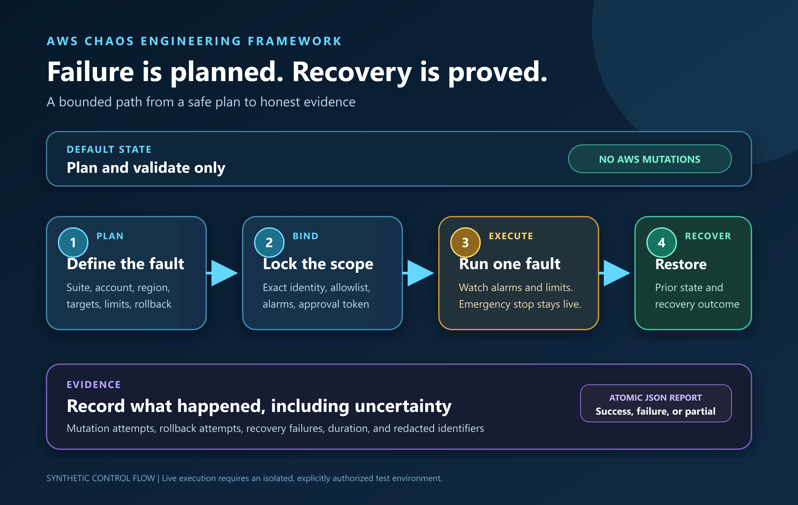

# AWS Chaos Engineering Framework

**Break AWS safely before reality does.**

[](https://github.com/fusiontechstrategies/AWS-Chaos-Engineering-Framework/actions/workflows/ci.yml)
[](https://github.com/fusiontechstrategies/AWS-Chaos-Engineering-Framework/actions/workflows/codeql.yml)
[](https://www.python.org/)
[](LICENSE)

An enterprise-minded, one-file chaos engineering orchestrator for AWS Fault Injection Service and carefully guarded service extensions. It combines AWS FIS templates, strict blast-radius controls, exact account binding, automatic rollback, emergency stops, and privacy-conscious evidence reports in a tool that remains easy to inspect and deploy.

[](docs/images/source/aws-chaos-guarded-experiment.svg)

> [!WARNING]
> This software intentionally disrupts AWS resources. Use it only in isolated, non-production environments that you own or are explicitly authorized to test. Review every plan, alarm, target, permission, and rollback path before live use.

## Why this framework exists

AWS FIS is the preferred execution engine whenever it provides the required fault. The framework adds a consistent control plane around FIS and extends coverage to service scenarios that FIS does not directly expose.

- 60 executable experiment modes across AWS FIS and guarded extensions
- GovCloud-aware region and ARN validation
- Plan mode by default, with no AWS mutations
- Exact account, region, suite, and target binding for live runs
- CloudWatch alarm gates and continuous runtime safety checks
- Cooperative emergency stop and automatic recovery for reversible actions
- Dual approval for irreversible actions and safety bypasses
- Tag-scoped VPC discovery with exact target allowlisting
- Local, atomic JSON evidence reports with identifiers redacted by default
- A single Python application file with no framework or database

The framework does not replace AWS FIS. It makes FIS easier to govern and supplies a guarded extension layer for additional AWS services.

Version 2.0.4 is available on [PyPI](https://pypi.org/project/aws-chaos-engineering-framework/2.0.4/) and as a verified GitHub release. Install it with `python -m pip install aws-chaos-engineering-framework==2.0.4`, then run the read-only `aws-chaos-framework --list-experiments` command. The [release page](https://github.com/fusiontechstrategies/AWS-Chaos-Engineering-Framework/releases/tag/v2.0.4) provides the standalone runtime, wheel, source distribution, SPDX SBOM, SHA-256 checksums, release evidence, and GitHub provenance attestations.

## Safety model

| Guardrail | Enforced behavior |
| --- | --- |
| Default mode | Plans and validates. It does not issue mutating AWS requests. |
| Identity binding | Live mode requires the active account, configured account, region, partition, and caller identity to agree. |
| Credentials | Temporary credentials are required by default. Long-term credentials need configuration and CLI approval. |
| Targets | Live extensions require exact allowlisting. Optional VPC discovery includes only resources with required safety tags. |
| Blast radius | Per-run and per-experiment limits are enforced before execution. |
| Stop controls | Extension runs require CloudWatch alarms by default. FIS templates require an alarm stop condition by default. |
| Confirmation | Live execution requires an exact, non-secret token containing the account, region, and suite. |
| Irreversible actions | Destructive actions require a stronger token plus two independent approvals. |
| Rollback | Reversible changes capture prior state, track AWS write attempts, and report recovery failures honestly. |
| Reports | Account, identity, alarm, and resource identifiers are omitted or redacted unless explicitly requested. |

Safety checks fail closed. Missing alarms, unresolved targets, mismatched identities, ambiguous target scopes, and unsupported experiment types stop live execution.

## Requirements

- Python 3.10 through 3.14
- An AWS identity with only the permissions needed by the selected experiments
- AWS FIS experiment templates for FIS-managed actions
- CloudWatch safety alarms for live extension runs
- A separate, explicitly approved test account or isolated test environment

The tool supports standard AWS partitions and both AWS GovCloud regions. CloudFront experiments are rejected when a GovCloud region is configured because CloudFront is not available in GovCloud.

## Quick start

Clone the repository and create an isolated Python environment:

```powershell
python -m venv .venv
.\.venv\Scripts\Activate.ps1
python -m pip install --upgrade pip
python -m pip install .
```

Create and validate a safe starter configuration:

```powershell
aws-chaos-framework --create-sample-config chaos.yaml
aws-chaos-framework --validate-config chaos.yaml
aws-chaos-framework --list-experiments
```

Plan a suite. Plan mode is the default:

```powershell
python .\aws_chaos_framework.py `
  --config .\chaos.yaml `
  --suite tagged_ec2_recovery `
  --vpc-id vpc-0123456789abcdef0 `
  --profile chaos-test
```

The included [example configuration](example-config.yaml) demonstrates tagged EC2 recovery and existing FIS template orchestration. Replace all placeholders before use.

## Moving from plan to live execution

Live mode is intentionally inconvenient. Complete these steps before enabling it:

1. Use an isolated test account or explicitly approved test environment.
2. Configure the exact account ID and region.
3. Use a dedicated, least-privilege role with temporary credentials.
4. Configure required target tags and an exact target allowlist.
5. Add CloudWatch safety alarms and verify their behavior.
6. Run and review the plan.
7. Print the exact confirmation token after reviewing the complete configuration. Any plan or safety change invalidates it.

```powershell
python .\aws_chaos_framework.py `
  --config .\chaos.yaml `
  --suite tagged_ec2_recovery `
  --profile chaos-test `
  --show-live-token
```

Then provide that exact token with `--live`:

```powershell
python .\aws_chaos_framework.py `
  --config .\chaos.yaml `
  --suite tagged_ec2_recovery `
  --profile chaos-test `
  --live `
  --confirm "LIVE:000000000000:us-gov-west-1:tagged_ec2_recovery"
```

Irreversible suites require `safety.allow_irreversible: true`, `--allow-irreversible`, and a token beginning with `LIVE-IRREVERSIBLE`. Safety bypasses also require matching approval in both configuration and the CLI.

## AWS FIS integration

Use `fis_template` to validate, start, monitor, and stop an existing AWS FIS experiment template. Before a live start, the framework checks:

- FIS execution-role partition and account ownership
- CloudWatch alarm stop conditions
- target selection modes and configured blast-radius limits
- exact ARN allowlists for explicit resources
- required tags for dynamically selected resources
- unbounded `ALL` or `PERCENT` selections

FIS remains responsible for its managed actions and recovery behavior. The framework monitors the experiment, applies framework safety checks while it runs, and requests a stop if an emergency condition occurs.

Useful AWS references:

- [AWS Fault Injection Service](https://aws.amazon.com/fis/)
- [AWS FIS actions reference](https://docs.aws.amazon.com/fis/latest/userguide/fis-actions-reference.html)
- [AWS FIS stop conditions](https://docs.aws.amazon.com/fis/latest/userguide/stop-conditions.html)
- [AWS FIS targets](https://docs.aws.amazon.com/fis/latest/userguide/targets.html)
- [AWS FIS in GovCloud](https://docs.aws.amazon.com/govcloud-us/latest/UserGuide/govcloud-fis.html)

## Experiment catalog

The catalog covers AWS FIS plus extensions for EC2, EBS, EFS, VPC, RDS, Lambda, S3, SQS, SNS, Elastic Load Balancing, ECS, Kinesis, OpenSearch, CloudFront, WAF, KMS, IAM, Directory Service, AppStream, ECR, CodeCommit, and SES.

Every catalog entry declares its provider, risk, live support, rollback model, and whether FIS is preferred:

```powershell
python .\aws_chaos_framework.py --list-experiments
```

The catalog intentionally includes some gated entries. An action is not live-supported when it cannot provide a real fault, bounded targeting, or an honest recovery contract. Host-level EC2 faults are represented through `fis_template` so that AWS FIS and SSM-managed actions provide the execution semantics.

## Evidence and privacy

Each suite creates an atomic JSON report in `chaos-reports/` unless another output directory is selected. Reports include mode, framework version, action status, duration, mutation attempts, rollback attempts, and recovery outcomes.

By default, reports omit AWS identity and resource identifiers. These fields can be enabled separately:

```yaml
reporting:
  include_identity: false
  include_resource_ids: false
  include_diagnostics: false
```

Reports and logs may still be operationally sensitive. Keep them out of source control and handle them according to your organization's data-classification rules. AWS API activity is recorded by CloudTrail when CloudTrail is configured for the account. The framework's local audit events are not a substitute for CloudTrail.

## Testing and release assurance

The release gate is fully offline and never contacts an AWS account. Deterministic fake clients exercise every advertised executable mode and fail immediately if plan mode attempts a write. Focused simulations also cover live policy rollback, route restoration and conflict refusal, WAF optimistic locking, IAM self-protection, FIS start guardrails, report no-overwrite behavior, redaction, configuration validation, and Botocore API request shapes.

Run the same checks locally:

```powershell
python -m pip install -r requirements-dev.txt
python -m ruff format --check .
python -m ruff check .
python -m pytest -q
python -m bandit -q -r .\aws_chaos_framework.py
python -m pip_audit -r .\requirements.txt
```

CI runs the test suite across supported Python versions and validates Python 3.12 on Windows and macOS. The release-candidate job builds normalized wheel and source archives twice, requires byte-identical results, installs each package independently, and preserves the exact six-file candidate as workflow evidence. CodeQL, Semgrep, Trivy, dependency auditing, secret scanning, and Dependabot are configured for the public repository.

See [TESTING.md](TESTING.md) for the complete offline gate and [RELEASING.md](RELEASING.md) for the exact asset contract. Tag automation can create only a draft GitHub release and cannot publish to a package registry.

## Design principles

- FIS first when AWS supplies a managed action
- No mutation without explicit live intent
- No target without exact scope
- No destructive action disguised as reversible
- No swallowed rollback error
- No secret or target inventory committed to the repository
- No claim of success when no resource was affected

## Contributing

Contributions are welcome. Start with [CONTRIBUTING.md](CONTRIBUTING.md), keep the runtime application in the single `aws_chaos_framework.py` file, and add offline tests for every behavior change. Pull requests must not require access to a real AWS account.

Security vulnerabilities should be reported privately as described in [SECURITY.md](SECURITY.md).

## License

Licensed under the [Apache License 2.0](LICENSE).

## Disclaimer

This project is community software and is not affiliated with, sponsored by, or endorsed by Amazon Web Services. AWS, AWS GovCloud, and related service names are trademarks of Amazon.com, Inc. or its affiliates. You are responsible for authorization, configuration, cost, availability impact, regulatory obligations, and recovery planning.
